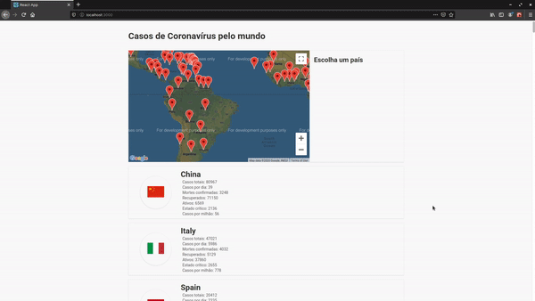

<h1>Coronavirus Tracker</h1>

Um rastreador de casos de coronavírus pelo mundo, mostrando os casos de cada país

    <a href="https://Andre-Alvim.github.io/CoronaVirus">Preview</a> |
    <a href="https://github.com/Andre-Alvim/CoronaVirus/tree/master/src">Código Fonte</a>

# Techs used

<b>Feito com</b>

1. [ReactJS](https://reactjs.org)

<b>Dependências</b>

1. [React(common react app)](https://reactjs.org)
2. [react-google-maps](https://github.com/tomchentw/react-google-maps)
3. [styled-components](https://styled-components.com/)

# Como countribuir?

1. Faça um fork desse repositório
2. Crie uma branch com sua modificação utilizando o comando `git checkout -b feature`
3. Faça um commit com suas alterações utilizando o comando `git commit -m "feat: Minha modificação"`
4. Dê push para o seu repositório utilizando o comando `git push -u origin feature`
5. Faça um pull request para esse repositório

# Como dar build?

1. Dê clone no repositório utilizando o comando `git clone git@github.com:Andre-Alvim/CoronaVirus.git`
2. Entre na pasta do repositório utilizando o comando `cd CoronaVirus`
3. Utilize o comando `npm run build` ou `yarn run build`(se estiver utilizando yarn) para construir o projeto
4. Entre na pasta build utilizando o comando `cd build`
5. Projeto pronto pra uso :)

# Licença

Este ainda não utiliza nenhuma licença :/
